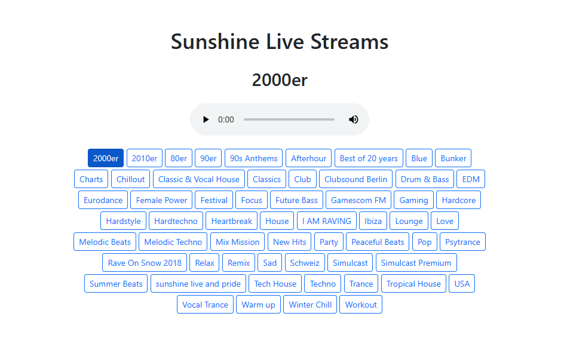

# Sunshine Live Streams

Dieses PowerShell-Skript durchsucht die Webseite von Sunshine Live, extrahiert die Titel und Links der verfügbaren Streams,sortiert sie alphabetisch und erstellt dann eine HTML-Datei mit einem Audioplayer und Buttons zum Abspielen der Streams. Alle Streams kommen direkt von Sunshine Live.

## Funktionen

- Durchsucht die Webseite von Sunshine Live
- Extrahiert Titel und Links der verfügbaren Streams
- Erstellt eine interaktive HTML-Seite mit einem Audioplayer und Buttons zum Abspielen der Streams
- Automatisches Abspielen des ersten Streams beim Laden der Seite
- Alle Streams kommen direkt von Sunshine Live

## Verwendung

1. Führen Sie das PowerShell-Skript `sunshine-live.ps1` aus.
2. Die generierte HTML-Datei `sunshine-live.html` wird im angegebenen Dateipfad gespeichert.
3. Öffnen Sie die HTML-Datei in einem Webbrowser, um die Sunshine Live Streams abzuspielen.

## Autor

ErikSlevin

## Credits

- Sunshine Live: [www.sunshine-live.de](https://www.sunshine-live.de/)
